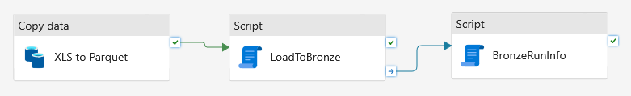
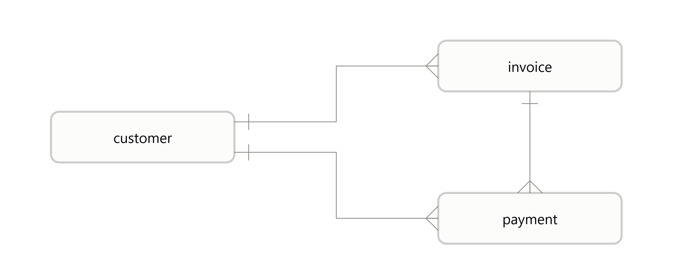
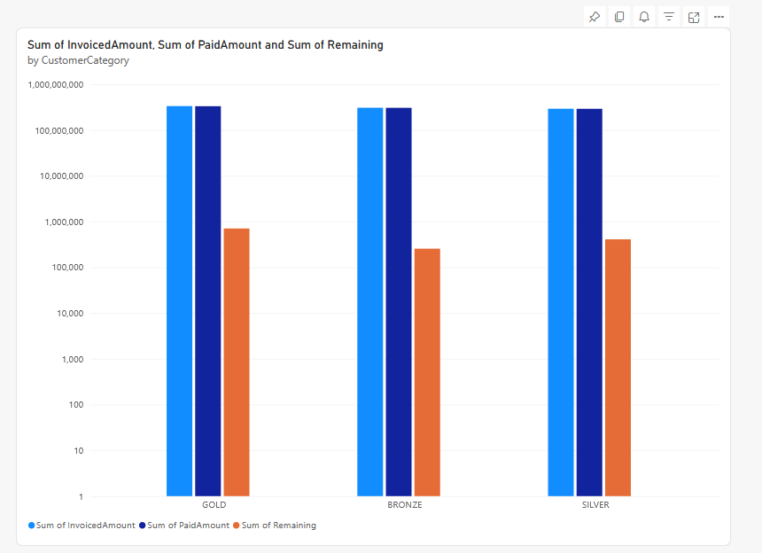
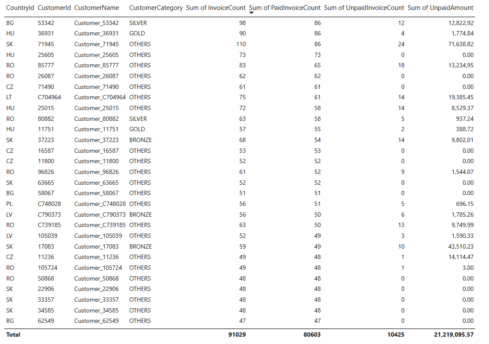
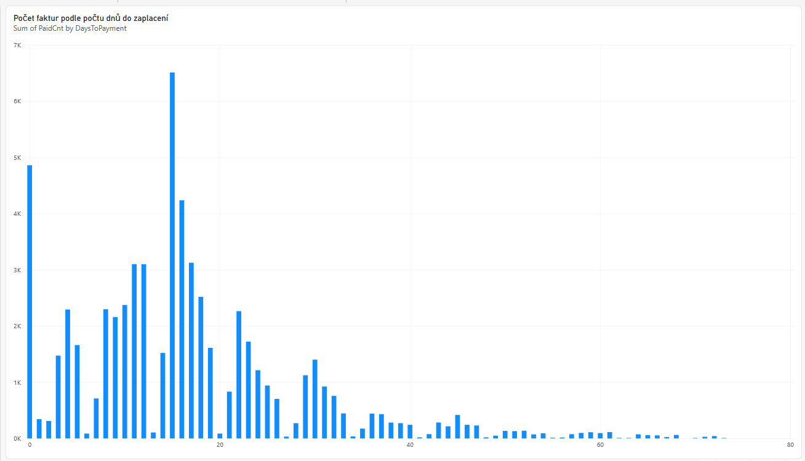

# Architecture

**Data solution has 4 layers.**

- Landing - cloud storage where the source files are expected
- Bronze - snapshot of source data (possibly more snapshots)
- Silver - core data store with data transformed into designed and maintained data model
- Gold - layer for subject specific data transformed into report-ready shape

**Pipelines**

Pipelines move and transform data. `Landing -> Bronze -> Silver -> Gold`  
Pipelines can be scheduled to periodically (or when triggered) update and refresh data
in our data solution,

- Pipeline_Bronze - read files from cloud storage and ingest into Bronze layer
- Pipeline_Silver - transform data from Bronze to Silver
- Pipeline_Gold  - refresh data in Gold layer

# Layers

## Bronze layer

 - Loaded by pipeline `Pipeline_Bronze`
 - One table per file ingested
 - Capable of storing multiple snapshots of one file (multiple versions as they arrived)
 - Data from files loaded as "append" - one Pipeline run, one snapshot
 - Audit metadata for each snapshot.
 - All data items as strings (varchar) without transformations
 - TODO: Maintenance job which will delete old snapshots based on data governance rules
 - TODO: Archive files which have been loaded

### Tables

| Table                    | Source                        |
| ------------------------ | ----------------------------- |
| bronze.customers         | customers.txt                 |
| bronze.invoices          | invoces.xlsx                  |
| bronze.payments          | payments.csv                  |
| bronze.pipeline_run_info | Metadata inserted by pipeline |

### Technical metadata and columns

Each table has the following technical metadata columns.  
Column `PipelineRunId` identifies one snapshot (batch).

| Column        | Note                                   |
| ------------- | -------------------------------------- |
| PipelineRunId | Run Id of pipeline which inserted data |
| ActivityName  | Pipeline Activity which inserted data  |
| IngestedTs    | Timestamp when row was inserted        |
| SourceFile    | Name of loaded source file             |

### Table pipeline_run_info

Audit metadata about run of Pipelines. Can be joined to bronze tables using `PipelineRunId`

| Column          | Note                     |
| --------------- | ------------------------ |
| PipelineRunId   | Id of one pipeline run   |
| PipelineName    | Pipeline name            |
| PipelineId      | Pipeline Id              |
| PipelineStartTs | Pipeline start timestamp |
| InsertedTs      | Insertion timestamp      |

### Excel File Load

Excel File is loaded in two steps
  1. It is read and stored in Lakehouse as parquet file (all columns as string, no transformation)
  2. Parquet file is loaded into Bronze table 

## Silver layer

- Designed data model
- Correct data types: decimal for monetary data, datetime for dates
- Idempotent load using MERGE statement
  - Soft-delete using column DeletedFlag (0 - active, 1 - deleted)
- Loaded by pipeline `Pipeline_Silver` 
- Loads only the last batch from bronze tables
- Basic data quality checks
  - Rows with data quality issues quarantined (invoice_bad, payment_bad)
  - Checks: PK null, wrong date string, wrong number string
- Audit technical columns (see below)

| Table              | PK                         | Notes                                                     |
| ------------------ | -------------------------- |-----------------------------------------------------------|
| silver.customer    | CustomerId                 |                                                           |
| silver.invoice     | CompanyId InvoiceNumber |                                                           |
| silver.payment     | CompanyId PaymentNumber | There are other types of transactions, not just payments. |
| silver.invoice_bad |                            | Rows from bronze.invoices with dat quality issues         |
| silver.payment_bad |                            | Rows from bronze.payments with dat quality issues         |

### Metadata audit attributes

Each table has the following technical metadata columns.

| Column         | Note                                      |
|----------------|-------------------------------------------|
| DeletedFlag    | 0 - active, 1 - deleted                   |
| InsertedTs     | Timestamp when row was inserted           |
| UpdatedTs      | Timestamp when row was updated            |
| InsertedRunId  | Run Id of pipeline which inserted the row |
| UpdatedRunId   | Run Id of pipeline which updated the row  |

## Gold Layer

 - Contains one datamart fo purpose of reports specified by the task
 - Table loaded as full refresh (truncate & insert)
 - Only records not marked as "deleted" in Silver

### Dimensions:

   - Customer
   - Country
   - Invoice Date
   - Posting Date
   - Company
   - Invoice Number
   - Payment Number

Apart from Customer dimension all other dimensions are degenerate dimension, they are just one attribute in a fact table.

### Fact tables

#### transaction_fact

  - all transactions, invoices and payments unioned
  - Calculated metrics:
    - SignedAmount - sign (negative or positive) determined base on PaymentType

#### invoice_balance_fact

  - invoice balance amount and sum of amounts per transaction type which contribute to balance
  - calculated metrics:
    - InvoicedAmount
    - PaymentAmount
    - CreditNoteAmount
    - RefundAmount
    - FinanceChargeAmount

### Note on Business logic
Source file `DS3_Payments.csv` is named "payments", but in fact it contains account ledger transactions.
There are not just payments. Possible transaction types below. Transaction type decides if balance increases or 
decreases. Based on data analysis I decided to treat amount as positive or negative 
based on transaction type and disregard if Amount itself in source data is with minus sign or not.

Some records have transaction type (DocumentType) = "Blank". I decided to treat them a payment which decresce balance
Invoice is fully settled (paid) if its balance is 0.

| Transastion Type    | Treat as | Note                                |
|---------------------|----------|-------------------------------------|
| Payment             | -        | Payment                             |
| Refund              | -        | seems to cancel out Invoice amount  |
| Finance Charge Memo | +        | some additional charge              |
| CR/Adj Note         | -        | Credit notice, decreases balance    |
| Blank               | -        | not certain, considered as payments |

# Pipelines

Pipeline is an execution and orchestration unit. In out simple example there is one pipeline per layer.
In real data solution there would be dozens of pipelines Each pipeline would have dependencies and 
there would be some orchestration mechanism which runs pipelines with defined timing, scheduling (frequency)
and in correct order in such way that dependencies are observed.  

# Infrastructure

I used Microsoft Fabric Free Tier so maybe not all features were available to me. 
It comes with its own ADLS storage as part of Fabric Lakehouse, so I used that instead of separate Storage Account.

### Landing / Raw Layer
uses Fabric Lakehouse - it can hold tables or files. Its file storage is used for incoming files.

### Bronze, Silver, Gold layer
uses Fabric Warehouse. Loading and transformation implemented as stored procedures.

### Jobs / Orchestration
uses Fabric Pipeline (ADF). Pipelines execute stored procedures to perform data load and transformation.
Pipelines can be triggerd on schedule or based on some other trigger (file arrival, external trigger).

# Reports

## Invoice Summary Report
### Power BI

## Customer Balance Report
### Power BI

### Excel
 - [Customer Balance Report - XLSX on OneDrive](https://tomasrohr-my.sharepoint.com/:x:/g/personal/trohr_tomasrohr_onmicrosoft_com/IQDfE0KiqGv3RIGOd9InW5EBAbS1hPYPiF7k9X2DnYLiVcA?email=adam.varga%40eurowag.com&e=6c3JCT)
 - [Read-only link](https://tomasrohr-my.sharepoint.com/:x:/g/personal/trohr_tomasrohr_onmicrosoft_com/IQDfE0KiqGv3RIGOd9InW5EBAV8vnNy1TH29MmXe4vkwli0?e=GUyc7g)

## Invoice Count by Days To Payment Histogram

To each invoice we calculated number of days it took to fully paid the invoice.  
This report shows histogram - how many invoices ware after certain number of days.

### Power BI

## Invoice Balance Analysis
  - [Invoice Balance Analysis - XLSX on OneDrive](https://tomasrohr-my.sharepoint.com/:x:/g/personal/trohr_tomasrohr_onmicrosoft_com/IQAok3msQjBJS4SCVnd8Z5xNAdyVyZuu8mqlwanCXVKYs3k?email=adam.varga%40eurowag.com&e=ZdOKxF)
  - [Read-only link](https://tomasrohr-my.sharepoint.com/:x:/g/personal/trohr_tomasrohr_onmicrosoft_com/IQAok3msQjBJS4SCVnd8Z5xNAZ8JUTsXM2HQs8vPj0TkjQE?e=tKeQtz)

